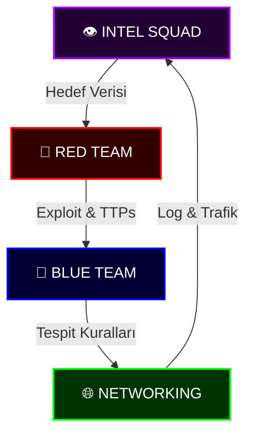

# 🛡️ CYBER SENTINEL: Ulusal Savunma Protokolü


<div align="center">


</div>

> "Dijital harp çağında sessizlik barış değil, sadece sızıntıdan önceki fırtınadır. Biz fırtınayı beklemeyiz; biz güvenlik duvarının *kendisiyiz*."

---

## 🦅 Görev Emri: Dijital Egemenlik

**Cyber Sentinel** sadece bir depo değil; bir **Ulusal Siber Savunma Harekat Merkezi**dir. Dijital sınırların elit koruması için tasarlanan bu platform, taarruz yeteneklerini, savunma stratejilerini ve derin istihbarat analizlerini birleştirir.

Tek bir mandamız var: **Dijital alanı güvenceye almak, savunmak ve fethetmek.**

---

## ⚡ Stratejik Öz Bilgiler (Quick Intelligence)

Harekatın en kritik bileşenleri için hızlı başvuru özeti:

| Kategori | Öncelikli Doktrin | Kritik Araç | Tehdit Seviyesi |
| :--- | :--- | :--- | :--- |
| **Saldırı (RED)** | Kernel-Level DKOM | `sentinel_recon` | 🔴 Yüksek |
| **Savunma (BLUE)** | eBPF Runtime Sec | `sentinel_integrity` | 🟢 Operasyonel |
| **İstihbarat (INTEL)** | AI OSINT Sentezi | `sentinel_whois` | 🟡 Stratejik |
| **Kuantum (PQC)** | Kyber-1024 / HNDL | `sentinel_hasher` | 🟠 Gelecek |

### 🛠️ Operasyonel Kontrol Listesi (5-Step Checklist)
1. **Keşif**: Hedefin dijital parmak izini ve sinyal profilini çıkar.
2. **Tehdit Analizi**: APT aktör grupları ve güncel TTP'ler ile eşleştir.
3. **Müdahale**: Zafiyeti doğrula veya savunma hattını (CI/CD) izole et.
4. **Kalıcılık/Direnç**: Savunma için eBPF kuralları, saldırı için gizli C2 hattı kur.
5. **Rapor**: Operasyonu dokümante et ve istihbarat döngüsünü tamamla.

---



---

## 📂 Protokol Haritası (Repository Tree)

Harekat merkezimizin taktiksel yerleşimi:

```text
CYBER_SENTINEL/
├── 🏛️ DOMINION_CORE_CYBER/      # Temel Teoriler & Akademi
│   └── 📜 README.md            # "Akademi"
├── 🔴 DOMINION_RED_TEAM/       # Taarruz Kuvvetleri
│   ├── 📂 TOOLS/               # sentinel_recon.py
│   └── 📜 README.md            # "Kızıl Kitap"
├── 🔵 DOMINION_BLUE_TEAM/      # Savunma Kuvvetleri
│   ├── 📂 TOOLS/               # sentinel_integrity.py
│   └── 📜 README.md            # "Mavi Kodeks"
├── 👁️ DOMINION_INTEL/          # İstihbarat Teşkilatı
│   ├── 📂 TOOLS/               # sentinel_whois.py
│   └── 📜 README.md            # "Gören Göz"
├── 🕸️ DOMINION_WEB_SECURITY/    # Web Güvenliği
│   └── 📜 README.md            # "Örümcek Ağı"
├── 🧪 DOMINION_MALWARE_ANALYSIS/# Zararlı Yazılım Analizi
│   └── 📜 README.md            # "Tersine Mühendislik"
├── 📱 DOMINION_MOBILE_SECURITY/ # Mobil Güvenlik
│   └── 📜 README.md            # "Mobil Cephesi"
├── ⚙️ DOMINION_DEVSECOPS/       # Güvenli Geliştirme
│   └── 📜 README.md            # "Güvenli Döngü"
├── 🔐 DOMINION_CRYPTOGRAPHY/   # Şifre Bilimi
│   ├── 📂 TOOLS/               # sentinel_hasher.py
│   └── 📜 README.md            # "The Cipher"
├── 🎭 DOMINION_HUMAN/          # İnsan Faktörü
│   ├── 📂 TOOLS/               # sentinel_phish.py
│   └── 📜 README.md            # "The Mind"
├── 🔌 DOMINION_HARDWARE/       # Donanım Güvenliği
│   ├── 📂 TOOLS/               # sentinel_serial.py
│   └── 📜 README.md            # "The Silicon"
├── ☁️ DOMINION_CLOUD/          # Bulut Güvenliği
│   ├── 📂 TOOLS/               # sentinel_bucket.py
│   └── 📜 README.md            # "The Sky"
├── 📡 DOMINION_WIRELESS/       # Kablosuz Ağlar
│   ├── 📂 TOOLS/               # sentinel_wifi.py
│   └── 📜 README.md            # "The Ether"
├── 🌐 DOMINION_NETWORKING/     # Altyapı Birimi
│   └── 📜 README.md            # "Şebeke"
├── 📜 CONTRIBUTING.md          # Katılım Protokolü
└── 📜 SECURITY.md              # Zafiyet Bildirimi
```

---

## 📜 Siber Doktrin: Asimetrik Doğrulama

Siber güvenlik, asimetrik bir savaştır. Saldırganın sadece bir kez başarılı olması gerekirken, savunmacının her zaman başarılı olması gerekir. Bu dengesizliği yönetmek için doktrinimiz üç sütuna dayanır:

1.  **Görünürlük (Visibility)**: Görmediğini savunamazsın. Ağdaki her paketi, diskteki her baytı bilmelisin.
2.  **Kararlılık (Resilience)**: Sistemler ihlal edilebilir; önemli olan ne kadar hızlı ayağa kalktıklarıdır.
3.  **Hücum Odaklı Savunma (Offensive Defense)**: Düşmanın taktiklerini bilmeden savunma kurulamaz. Red Team, Blue Team'i eğitir; Blue Team, Red Team'i zorlar.

---

## 🗺️ Saha Operasyonları: DOMINIONS (Hükümranlık Alanları)

Operasyonel mimarimiz, siber harbin belirli tiyatroları için özelleşmiş **14 Stratejik Dominion**'a bölünmüştür. Her bir link, ilgili alanın derinlemesine bilgi tabanına, araçlarına ve operasyonel doktrinlerine açılan bir kapıdır.

### [🏛️ DOMINION: CORE CYBER (Akademi & Temel Teoriler)](DOMINION_CORE_CYBER/README.md)
*Siber güvenliğin genetik kodu ve bilimsel temeli.*
- **İçerik**: CIA Triad, AAA Framework, Risk Analizi (Quantitative/Qualitative) ve formal güvenlik modelleri (Bell-LaPadula, Biba).
- **Stratejik Derinlik**: Zero Trust mimarisi, KVKK/GDPR uyumluluğu ve siber güvenliğin sivil/askeri standartları.
- **Ekstrem**: Uzay ve Uydu güvenliği (Telemetry Hijacking, Orbital Resilience) doktrinleri.

### [🔴 DOMINION: RED TEAM (Taarruz Operasyonları)](DOMINION_RED_TEAM/README.md)
*Gölge operasyonlar ve sızma sanatının zirvesi.*
- **İçerik**: Keşif zinciri, exploit geliştirme (BOF, ROP), AD Dominance (Delegation Attacks, Kerberoasting).
- **Operasyonel**: C2 altyapıları, EDR Evasion teknikleri ve Kernel-seviyesi (DKOM, Rootkits) saldırı metodolojileri.
- **Fiziksel**: RFID/NFC klonlama, BadUSB (Rubber Ducky) ve fiziksel atlatma yöntemleri.

### [🔵 DOMINION: BLUE TEAM (Savunma & Olay Müdahale)](DOMINION_BLUE_TEAM/README.md)
*Sonsuz nöbet ve otonom savunma hattı.*
- **İçerik**: SIEM/SOAR orkestrasyonu, Sigma kuralları ile tespit mühendisliği ve DFIR (Digital Forensics & Incident Response).
- **Teknoloji**: eBPF ile çekirdek izleme, bellek adli bilişimi (Volatility) ve YARA kural yazımı.
- **Direnç**: Kendi kendini iyileştiren (Self-Healing) altyapılar ve otomatik izolasyon (Auto-Containment) senaryoları.

### [👁️ DOMINION: INTEL (İstihbarat & OSINT)](DOMINION_INTEL/README.md)
*Bilgi güçtür. Mutlak bilgi ise tahakkümdür.*
- **İçerik**: İstihbarat döngüsü, Diamond Model, STIX/TAXII standartları ve veri görselleştirme (Maltego, Graph-based Intel).
- **Modern**: AI destekli IntelOps, otomatik aktör profilleme ve sentetik medya (Deepfake) tespiti.
- **Derin**: Dark Web izleme, APT gruplarının (Lazarus, Cozy Bear vb.) TTP analizi ve ileri OPSEC doktrinleri.

### [🕸️ DOMINION_WEB_SECURITY (Web & API Güvenliği)](DOMINION_WEB_SECURITY/README.md)
*Kod kanundur, açık ise isyan.*
- **İçerik**: OWASP Top 10 ötesi; SSRF, GraphQL güvenlik açıkları ve karmaşık OAuth/OIDC zafiyetleri.
- **API**: BOLA (Broken Object Level Authorization), Mass Assignment ve Shadow API keşif metodolojileri.
- **Bounty**: Bug Bounty keşif zinciri (ASN Discovery, JS Mining) ve modern browser internal güvenliği.

### [🧪 DOMINION_MALWARE_ANALYSIS (Zararlı Yazılım Analizi)](DOMINION_MALWARE_ANALYSIS/README.md)
*Düşmanın zihnini parçalarına ayır.*
- **İçerik**: Statik ve dinamik analiz, Ghidra/IDA Pro ile tersine mühendislik ve .NET/Golang malware analizi.
- **İleri**: Sandbox atlatma teknikleri (Anti-VM, Anti-Debug), deobfuscation ve AI tabanlı zararlı tespiti.
- **Otomasyon**: Kendi malware avcısı imzalarınızı oluşturmak için YARA ve Ghidra scripting.

### [📱 DOMINION_MOBILE_SECURITY (Mobil Cephesi)](DOMINION_MOBILE_SECURITY/README.md)
*Cebinizdeki casusu susturun.*
- **İçerik**: Android (APK) ve iOS (IPA) uygulama analizi, Frida ile runtime manipülasyonu ve Smali kod analizi.
- **Adli**: iOS Keychain forensics ve Android Root Detection bypass teknikleri.
- **Güvenlik**: Mobil uygulama ekosistemindeki gizli veri sızıntıları ve API haberleşme güvenliği.

### [⚙️ DOMINION_DEVSECOPS (Sürekli Güvenlik)](DOMINION_DEVSECOPS/README.md)
*Güvenlik, hattın her adımındadır.*
- **İçerik**: CI/CD boru hattına entegre güvenlik; SBOM, SLSA uyumluluğu ve Policy as Code (OPA/Rego).
- **Otomasyon**: IaC tarama (Checkov, Tfsec), GitOps güvenliği (Flux/ArgoCD) ve VEX standartları.
- **Döngü**: Yazılım yaşam döngüsünün her adımında otomatik zafiyet tespiti ve yönetimi.

### [🔐 DOMINION_CRYPTOGRAPHY (Kriptoloji & Gizlilik)](DOMINION_CRYPTOGRAPHY/README.md)
*Matematiğin karanlık şiiri.*
- **İçerik**: Klasik ve Eliptik Eğri (ECC) kriptografisi, Zero-Knowledge Proofs (ZKP) ve Blockchain güvenliği.
- **Gelecek**: Kuantum Anahtar Dağıtımı (QKD) ve Post-Quantum (PQC) geçiş stratejileri (Kyber, Dilithium).
- **Steganografi**: Veriyi fiziksel ve dijital medyalarda gizleme teknikleri (Sentinel Hasher dahil).

### [🎭 DOMINION_HUMAN (Psikoloji & Sosyal Mühendislik)](DOMINION_HUMAN/README.md)
*Zihin en savunmasız işletim sistemidir.*
- **İçerik**: Bilişsel önyargılar (Cognitive Biases), Cialdini'nin ikna prensipleri ve Siber Psikoloji.
- **Harekat**: Siber Psikolojik Harekat (PsyOps), algı yönetimi ve kriz anında yönetim stratejileri.
- **Sosyal**: Phishing otomasyonu ve gelişmiş sosyal mühendislik senaryoları.

### [🔌 DOMINION_HARDWARE (Donanım & ICS/SCADA)](DOMINION_HARDWARE/README.md)
*Silikonun arka kapıları.*
- **İçerik**: IoT cihaz güvenliği, UART/JTAG hacking ve PCB (Baskı Devre) tersine mühendisliği.
- **Endüstriyel**: PLC güvenliği, Modbus/DNP3 protokol analizi ve kritik altyapı savunması.
- **Analiz**: Sinyal bütünlüğü analizi (Oscilloscopes/Logic Analyzers) ve donanımsal Root of Trust.

### [☁️ DOMINION_CLOUD (Bulut Altyapı Güvenliği)](DOMINION_CLOUD/README.md)
*Gökyüzündeki kale.*
- **İçerik**: AWS/Azure/GCP mimari güvenliği, K8s (Kubernetes) atlatma teknikleri ve CNAPP stratejileri.
- **İleri**: Confidential Computing (TEE, Intel SGX) ve Service Mesh (Istio/mTLS) güvenliği.
- **Yönetim**: Kimlik merkezli güvenlik (Identity-First) ve bulut tabanlı olay müdahalesi.

### [📡 DOMINION_WIRELESS (Kablosuz & RF Güvenliği)](DOMINION_WIRELESS/README.md)
*Havadaki sırlar.*
- **İçerik**: 802.11 (Wi-Fi) saldırıları, BLE (Bluetooth Low Energy) hacking ve LoRaWAN güvenliği.
- **SDR**: Software Defined Radio üzerinden RF sinyal analizi ve 5G ağ güvenliği mimarisi.
- **IoT**: Zigbee ve Z-Wave gibi düşük güçlü iletişim protokollerinin siber güvenliği.

### [🌐 DOMINION_NETWORKING (Ağ Altyapısı)](DOMINION_NETWORKING/README.md)
*Dünyanın üzerine inşa edildiği kafes.*
- **İçerik**: BGP Hijacking, IPv6 güvenliği ve Zero Trust Network Access (ZTNA) implementasyonu.
- **Programlanabilir**: P4 Programming, In-band Network Telemetry (INT) ve Egemen Mesh (Sovereign Mesh) ağları.
- **Analiz**: Scapy ile paket manipülasyonu ve derin paket inceleme (DPI) metodolojileri.

---

## ⚔️ Dijital Harp Metodolojisi: Entegre Operasyonlar

Cyber Sentinel, birimlerin (Dominion'ların) senkronize çalışması üzerine kuruludur. Bir siber operasyon aşağıdaki katmanlarda eşzamanlı yürütülür:

### 📡 Katman 1: Sinyal ve Altyapı (Physical & Link)
- **Birimler**: `HARDWARE`, `WIRELESS`, `NETWORKING`
- **Görev**: Fiziksel erişim, paket yakalama ve şebeke manipülasyonu.

### 🧩 Katman 2: Veri ve Bilgi (Intelligence)
- **Birimler**: `INTEL`, `CRYPTOGRAPHY`
- **Görev**: OSINT üzerinden hedef profilleme ve şifreli verilerin analizi.

### 💀 Katman 3: Taarruz ve Sömürü (Execution)
- **Birimler**: `RED_TEAM`, `WEB_SECURITY`, `MOBILE_SECURITY`
- **Görev**: Exploit geliştirme, zafiyet sömürme ve yanal hareket.

### 🛡️ Katman 4: Savunma ve Müdahale (Resilience)
- **Birimler**: `BLUE_TEAM`, `DEVSECOPS`, `MALWARE_ANALYSIS`
- **Görev**: Tehdit avcılığı, CI/CD güvenliği ve tersine mühendislik.

---

## 🧰 Operasyonel Araç Galerisi (Consolidated Arsenal)

Tüm Dominion'lardaki en etkili araçların merkezi listesi:

| Kategori | Yerleşik Araç (Sentinel Series) | Dış Kaynaklı Devler (Industry Standard) |
| :--- | :--- | :--- |
| **Keşif** | `sentinel_recon.py`, `sentinel_whois.py` | `Nmap`, `Shodan`, `ZMap` |
| **Sömürü** | `sentinel_web.py`, `sentinel_phish.py` | `Metasploit`, `Burp Suite`, `BeEF` |
| **Analiz** | `sentinel_integrity.py`, `sentinel_malware.py`| `Ghidra`, `Wireshark`, `Cuckoo` |
| **Bulut/Mobil**| `sentinel_bucket.py`, `sentinel_mobile.py` | `Pacu`, `MobSF`, `Frida` |
| **Kripto** | `sentinel_hasher.py` | `Hashcat`, `John`, `CyberChef` |

---

## ☣️ Global Tehdit Matrisi: APT Grupları & TTPs

İstihbarat birimimizin radarındaki en tehlikeli aktörler:

> [!CAUTION]
> Bu veriler sadece eğitim ve savunma stratejisi geliştirme amacıyla derlenmiştir.

| APT Grubu | Menşei | Ana Hedefler | Favori TTPs (Taktik, Teknik, Prosedürler) |
| :--- | :--- | :--- | :--- |
| **Lazarus Group** | Kuzey Kore | Finans, Kripto, Altyapı | Custom Malware, BEC, Phishing |
| **APT29 (Cozy Bear)**| Rusya | Hükümetler, Enerji | Stealth, C2 via Cloud Services |
| **APT41** | Çin | Teknoloji, Sağlık | Supply Chain Attacks, SQLi, Espionaj |
| **Equation Group** | ABD | Şifreleme, Telekom | Zero-day exploits, HDD Firmware rootkits |

---

## 🚀 Stratejik Yol Haritası (Mission Roadmap)

Cyber Sentinel, sürekli evrilen bir organizmadır.

### 🟢 FAZ 1: Altyapı ve Doktrin (Tamamlandı)
- Core Dominion yapısının kurulması.
- Temel Python araçlarının (`sentinel_` serisi) entegrasyonu.
- Doktrinlerin (README) Türkçeleştirilmesi ve zenginleştirilmesi.

### 🟡 FAZ 2: Otomasyon ve Derinlik (Devam Ediyor)
- CI/CD boru hattına güvenlik taramalarının entegre edilmesi.
- Her Dominion için özel laboratuvar senaryoları (CTF benzeri).
- `sentinel_` araçlarının yapay zeka destekli analiz yetenekleriyle donatılması.

### 🔴 FAZ 3: Global Hub & Ekosistem (Planlandı)
- Topluluk tabanlı bir siber istihbarat akışı (Feed) oluşturma.
- Sertifikasyon hazırlık kitleri (OSCP, CEH, CISSP).
- Ulusal siber güvenlik projeleriyle entegrasyon çalışmaları.

---

## 🤝 Protokole Katıl: Elit Birime Dahil Ol

Cyber Sentinel, bireysel dehanın kolektif güçle birleştiği yerdir. Katkıda bulunmak için şu protokolü takip edin:

1.  **İstihbarat Analizi**: Mevcut bir Dominion'daki eksikleri tespit edin.
2.  **Saldırı/Savunma Geliştirme**: Yeni bir betik veya metodoloji yazın.
3.  **Hata Raporu**: `SECURITY.md` protokolüne uygun zafiyet bildirimi yapın.
4.  **Onay Süreci**: Pull Request'iniz `SENTINEL_CORE` ekibi tarafından incelenecek ve uygunsa ana repoya (Mainframe) merge edilecektir.

---

## 🛡️ Standart Operasyon Prosedürleri (SOP)

1.  **Etik İlkeler**: Sadece izinli sistemlerde (yasal sınırlar içinde) test yapılır.
2.  **Belgeleme**: Yapılan her işlem, oluşturulan her script belgelenmelidir.
3.  **Güvenlik**: Bu repo içerisinde **asla** canlı zararlı yazılım (live malware) barındırılmaz. Sadece de-aktif edilmiş örnekler (defanged) bulunur.

---

*© 2024 Cyber Sentinel İnisiyatifi. "Kod Kanundur, Güvenlik Nizamdır."*
*Tüm Hakları Saklıdır.*


---

##  Geliştirici Hakkında

<div align="center">

### **Bahattin Yunus Çetin**
**IT Architect** | **Siber Güvenlik Uzmanı**

[](https://github.com/bahattinyunus)
[](https://www.linkedin.com/in/bahattinyunus/)

*Ulusal siber güvenlik yeteneklerinin geliştirilmesi ve açık kaynak istihbarat araçlarının demokratikleştirilmesi misyonuyla çalışmaktadır.*

</div>

---
